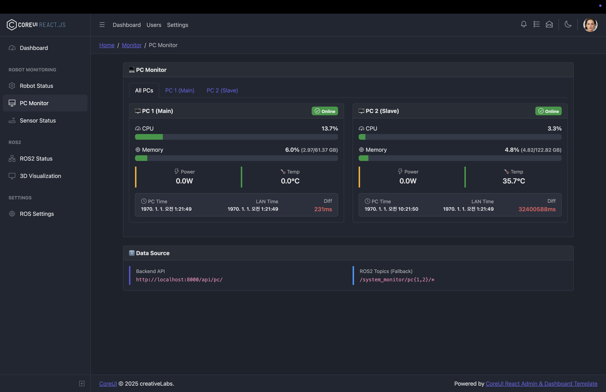
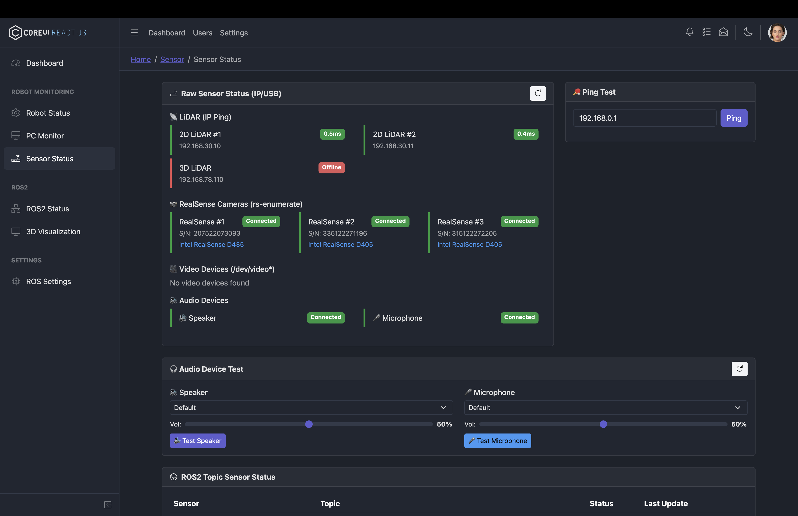
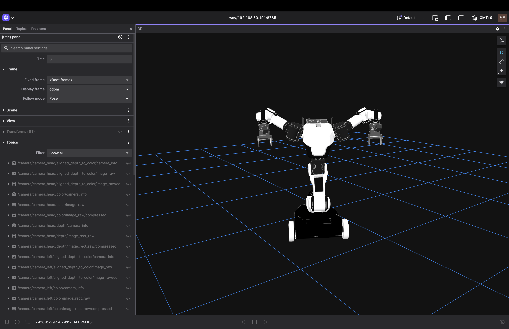

# 🤖 로봇 Web UI 개발 가이드

CoreUI Free React Admin Template을 기반으로 한 로봇 전용 Web UI입니다.  
ROS2 rosbridge와 연동하여 실시간 로봇 모니터링 및 시각화 기능을 제공합니다.

---

## 구현된 페이지

| 페이지 | 설명 |
|--------|------|
| **Dashboard** | ROS 연결, 배터리, PC, 센서 상태 요약 |
| **Robot Status** | 배터리, Joint States, Diagnostics |
| **PC Monitor** | 2대 PC의 CPU/Memory/GPU/전력/온도 |
| **Sensor Status** | 센서별 연결 상태, 주파수, 네트워크 |
| **ROS2 Status** | Domain ID, 대역폭, 노드 목록, 토픽 Hz |
| **Visualization** | Custom/MoveIt/Nav2 전용 뷰어 |

| PC Monitor | Sensor Status |
| - | - |
|||

### Foxglove


## 아키텍처

```
┌────────────────────────────────────────────────────────┐
│  로봇 PC1 (Main) - Backend 실행                        │
│                                                        │
│  [FastAPI Backend]                                     │
│     ├── PC1: 직접 psutil (localhost)                   │
│     ├── PC2: SSH로 원격 조회                            │
│     ├── ROS2: rclpy로 직접 구독 (rosbridge 불필요)      │
│     ├── Sensors: ping, rs-enumerate, /dev/video        │
│     └── Frontend: 빌드 파일 서빙                        │
│                                                        │
│  LAN: 192.168.1.x (ROS2 통신)                          │
│  WiFi: 10.0.0.x (Web UI 접속)                          │
└────────────────────────────────────────────────────────┘
              │
              │ WiFi (HTTP만, 작은 JSON)
              ▼
        [브라우저] http://로봇WiFiIP:8000
```

## 실행 방법

### 1. 환경 설정 (최초 1회)
```bash
cd /<your workspace>/RobotUI/backend

# .env 파일 생성
cp .env.example .env
# PC2 IP, 센서 IP, RealSense 시리얼 등 입력

# Python 의존성 설치
pip install -r requirements.txt

# vite 등 설치  : package.json에 있는거
npm install
```

### 2. Frontend 빌드
```bash
cd /<your workspace>/RobotUI
npm run build
```

### 3. 서버 실행 (로봇 PC에서)
```bash
cd /<your workspace>/RobotUI/backend

# ROS2 환경 활성화
source /opt/ros/humble/setup.bash

# 1) Backend 실행 (터미널 1)
uvicorn main:app --host 0.0.0.0 --port 8000

# 2) 3D 시각화를 위한 Foxglove Bridge 실행 (터미널 2)
# sudo apt install ros-humble-foxglove-bridge
ros2 launch foxglove_bridge foxglove_bridge_launch.xml port:=8765
```

### 4. 브라우저 접속
```
http://로봇WiFiIP:8000
```
- **3D Visualization** 메뉴 클릭 시 로봇과 연결된 Foxglove Studio가 표시됩니다.

---

## 파일 구조

```
├── backend/                     # Python FastAPI 백엔드
│   ├── main.py                  # 앱 진입점
│   ├── config.py                # 설정 (PC IP, 센서 등)
│   ├── requirements.txt
│   ├── .env.example             # 환경변수 예시
│   ├── routers/
│   │   ├── robot.py             # /api/robot - SDK 연동
│   │   ├── pc.py                # /api/pc - SSH PC 모니터링
│   │   └── sensors.py           # /api/sensors - 센서 확인
│   └── services/
│       ├── robot_sdk.py         # Robot SDK (placeholder)
│       ├── pc_monitor.py        # SSH PC 상태 조회
│       └── sensor_check.py      # ping, rs-enumerate
│
└── src/                         # React Frontend
    ├── context/
    │   └── RosContext.js        # ROS 연결 관리
    ├── hooks/
    │   ├── useRosTopic.js       # ROS 토픽 구독 훅
    │   └── useApi.js            # 백엔드 API 호출 훅
    ├── views/
    │   ├── dashboard/Dashboard.js
    │   ├── robot/RobotStatus.js
    │   ├── monitor/PCMonitor.js   # PC Time/LAN Time 포함
    │   ├── sensor/SensorStatus.js # IP ping, RealSense 포함
    │   ├── ros2/Ros2Status.js
    │   ├── settings/RosSettings.js
    │   └── visualization/
    │       ├── CustomViewer.js
    │       ├── MoveItViewer.js
    │       └── Nav2Viewer.js
    ├── _nav.js                  # 사이드바 메뉴
    └── routes.js                # 라우팅 설정
```

---

## 📝 페이지별 수정 가이드

### 1. Dashboard 수정
**파일**: `src/views/dashboard/Dashboard.js`

| 수정 항목 | 위치 | 방법 |
|----------|------|------|
| 상단 위젯 추가/삭제 | `<CRow>` 첫 번째 블록 | `<CCol>` 안에 위젯 컴포넌트 추가 |
| 토픽 목록 변경 | `topics` 배열 | name, type 수정 |
| 배터리 토픽 변경 | `BatteryWidget` 컴포넌트 | `useRosTopic('/battery_state', ...)` 수정 |

```javascript
// 예: 새 위젯 추가
<CCol sm={6} lg={3}>
  <YourCustomWidget />
</CCol>
```

---

### 2. Robot Status 수정
**파일**: `src/views/robot/RobotStatus.js`

| 수정 항목 | 방법 |
|----------|------|
| 배터리 토픽 변경 | Line ~30: `useRosTopic('/battery_state', 'sensor_msgs/BatteryState')` |
| Joint States 토픽 | Line ~60: `useRosTopic('/joint_states', ...)` |
| Diagnostics 토픽 | Line ~80: `useRosTopic('/diagnostics', ...)` |
| 새 상태 카드 추가 | `<CRow>` 안에 새 `<CCard>` 컴포넌트 추가 |

---

### 3. PC Monitor 수정
**파일**: `src/views/monitor/PCMonitor.js`

| 수정 항목 | 위치 |
|----------|------|
| PC 토픽 prefix 변경 | Line ~20: `PC_TOPICS` 상수 |
| 모니터링 항목 추가 | `SinglePCMonitor` 컴포넌트에 새 `useRosTopic` 추가 |
| PC 개수 변경 | `PC_TOPICS` 배열에 새 PC 추가/삭제 |

```javascript
// 토픽 prefix 수정 예시
const PC_TOPICS = {
  pc1: '/system_monitor/pc1',  // ← 여기 수정
  pc2: '/system_monitor/pc2',
}
```

---

### 4. Sensor Status 수정
**파일**: `src/views/sensor/SensorStatus.js`

| 수정 항목 | 위치 | 방법 |
|----------|------|------|
| 센서 목록 변경 | Line ~50: `SENSORS` 배열 | name, topic, type 수정 |
| Ping IP 변경 | Line ~100: `pingTarget` state | 기본값 수정 |
| 네트워크 토픽 | `NetworkStatusCard` | useRosTopic 호출 수정 |

```javascript
// 센서 추가 예시
const SENSORS = [
  { name: 'RGB Camera', topic: '/camera/color/image_raw', type: 'sensor_msgs/Image' },
  { name: 'Your Sensor', topic: '/your_sensor_topic', type: 'your_msg/Type' },  // ← 추가
]
```

---

### 5. ROS2 Status 수정
**파일**: `src/views/ros2/Ros2Status.js`

| 수정 항목 | 위치 |
|----------|------|
| 모니터링 토픽 목록 | Line ~73: `MONITORED_TOPICS` 배열 |
| Domain ID 토픽 | Line ~106: `useRosTopic('/ros_info/domain_id', ...)` |
| 대역폭 토픽 | Line ~167: `useRosTopic('/ros_info/bandwidth', ...)` |

```javascript
// 토픽 추가 예시
const MONITORED_TOPICS = [
  { name: '/joint_states', type: 'sensor_msgs/JointState' },
  { name: '/your_topic', type: 'your_msg/Type' },  // ← 추가
]
```

---

### 6. Visualization 수정

#### Custom Viewer
**파일**: `src/views/visualization/CustomViewer.js`

| 수정 항목 | 방법 |
|----------|------|
| 카메라 토픽 | `useRosTopic('/camera/color/image_raw', ...)` 수정 |
| TF 프레임 | `selectedFrame` 목록 수정 |
| 마커 토픽 | `useRosTopic('/visualization_marker', ...)` 수정 |

#### MoveIt Viewer
**파일**: `src/views/visualization/MoveItViewer.js`

| 수정 항목 | 방법 |
|----------|------|
| Joint 이름 | `JOINTS` 상수 수정 |
| Trajectory 토픽 | `useRosTopic('/display_trajectory', ...)` 수정 |
| Gripper 토픽 | gripping action 토픽 수정 |

#### Nav2 Viewer
**파일**: `src/views/visualization/Nav2Viewer.js`

| 수정 항목 | 방법 |
|----------|------|
| Map 토픽 | `useRosTopic('/map', ...)` 수정 |
| Pose 토픽 | `useRosTopic('/amcl_pose', ...)` 수정 |
| Goal action | `useRosPublisher('/goal_pose', ...)` 수정 |

---

### 7. 사이드바 메뉴 수정
**파일**: `src/_nav.js`

```javascript
// 메뉴 항목 추가
{
  component: CNavItem,
  name: '새 페이지',           // 표시 이름
  to: '/new-page',           // URL 경로
  icon: <CIcon icon={cilSpeedometer} customClassName="nav-icon" />,
}
```

---

### 8. 새 페이지 추가 절차

1. **컴포넌트 생성**: `src/views/your-folder/YourPage.js`
2. **라우트 등록**: `src/routes.js`에 추가
   ```javascript
   const YourPage = React.lazy(() => import('./views/your-folder/YourPage'))
   // routes 배열에 추가:
   { path: '/your-page', name: 'Your Page', element: <YourPage /> }
   ```
3. **메뉴 추가**: `_nav.js`에 항목 추가

---

### 9. ROS 연결 설정 변경
**파일**: `src/context/RosContext.js`

```javascript
// Line 16: 기본 WebSocket URL 변경
export const RosProvider = ({ children, url = 'ws://로봇IP:9090' }) => {
```

또는 **App.js**에서:
```javascript
<RosProvider url="ws://192.168.1.100:9090">
```

---

### 10. 유용한 훅 사용법

```javascript
// 토픽 구독
const { message, hz, isSubscribed } = useRosTopic('/topic_name', 'msg/Type')

// 토픽 발행
const publish = useRosPublisher('/topic_name', 'msg/Type')
publish({ data: 'value' })

// 서비스 호출
const { call, isLoading, result } = useRosService('/service_name', 'srv/Type')
await call({ request_field: 'value' })

// 파라미터 읽기/쓰기
const { value, get, set } = useRosParam('/param_name')
await set(newValue)
```

---

## 기술 스택

| 항목 | 기술 |
|------|------|
| Frontend | React 18 + Vite |
| UI Framework | CoreUI 5.x |
| ROS2 연동 | roslib.js (WebSocket) |
| 상태관리 | React Context + Hooks |
